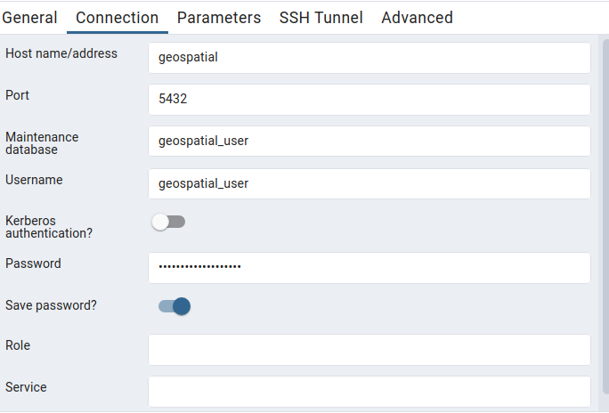

 Commands
This is to start the server
<!-- ```bash
docker run --name geospatial -e POSTGRES_PASSWORD=geospatial_password -e POSTGRES_USER=geospatial_user -e POSTGRES_DB=geospatial_db -p 5432:5432 postgis/postgis:15-3.4 -rm
``` -->
```bash
docker compose build
docker compose up
```
This is to exec into the container
```bash
docker exec -ti geospatial psql -U geospatial_user
```

Now go to `localhost:5050` and enter the credentials and establish connection between pgadmin and postgresql. Right click on servers on the left hand side and click on register.


Download osm data from `http://download.geofabrik.de/`

To load data into postgres use
```bash
docker exec -it geospatial osm2pgsql -c -d geospatial_db -U geospatial_user -W path/to/osmfile
```

## Postgres commands
`\l` to list databases
`\c database_name` to use database
`\dt` to show tables
`\dx` to view all extensions